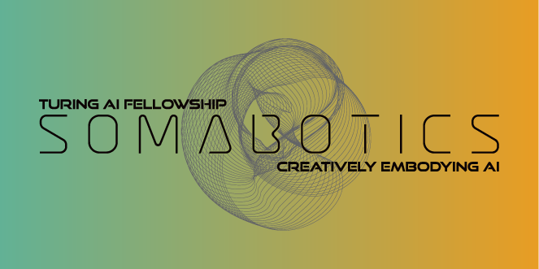

# Programme

The conference runs **Tuesday 29 – Wednesday 30 September 2026**. The full programme is on the **[Programme page]({{ "program.html" | relative_url }})**, with day-by-day schedules:

* [Day 1 – Tuesday 29 September]({{ 'day-1.html' | relative_url }})
* [Day 2 – Wednesday 30 September]({{ 'day-2.html' | relative_url }})

Talk and poster details are on each session page (including poster board numbers).

## Evening screening – AI LENS

On **Tuesday 29 September, 19:00–21:00**, join the Somabotics Turing AI Fellowship for **[AI LENS: Stories from the Latent Space](https://www.eventbrite.com/e/ai-lens-stories-from-the-latent-space-tickets-1997139756774){:target="_blank"}** at Broadway Cinema, Nottingham. This is a free screening of three short films created with AI LENS, followed by a short panel. Open to conference delegates and the public. **Booking is required** via [Eventbrite](https://www.eventbrite.com/e/ai-lens-stories-from-the-latent-space-tickets-1997139756774).

# Venue

The conference will be hosted in {{ site.data.conference.location }}, from <b>{{ site.data.conference.dates[0] | date: "%A, %-d %B %Y" }} to {{ site.data.conference.dates.last | date: "%A, %-d %B %Y" }}</b> at <a href="{{ site.data.conference.venue_url }}" target="_blank">{{ site.data.conference.venue }}</a>. Further details about the exact venue and travel information can be found on the **[Venue page]({{ "venue.html" | relative_url }})**.

# Registration



## Key Dates



Background on topics and format is on the **[Call for Papers]({{ "call-for-papers.html" | relative_url }})** page (submissions are now closed).

# Organizing Committee

General inquiries should be sent to [{{ site.author.email }}](mailto:{{ site.author.email }}).



# Sponsors

This work is being supported by the Engineering and Physical Sciences Research Council (EPSRC) through the Turing AI World Leading Researcher Fellowship: Somabotics: Creatively Embodying Artificial Intelligence [grant number EP/Z534808/1]
